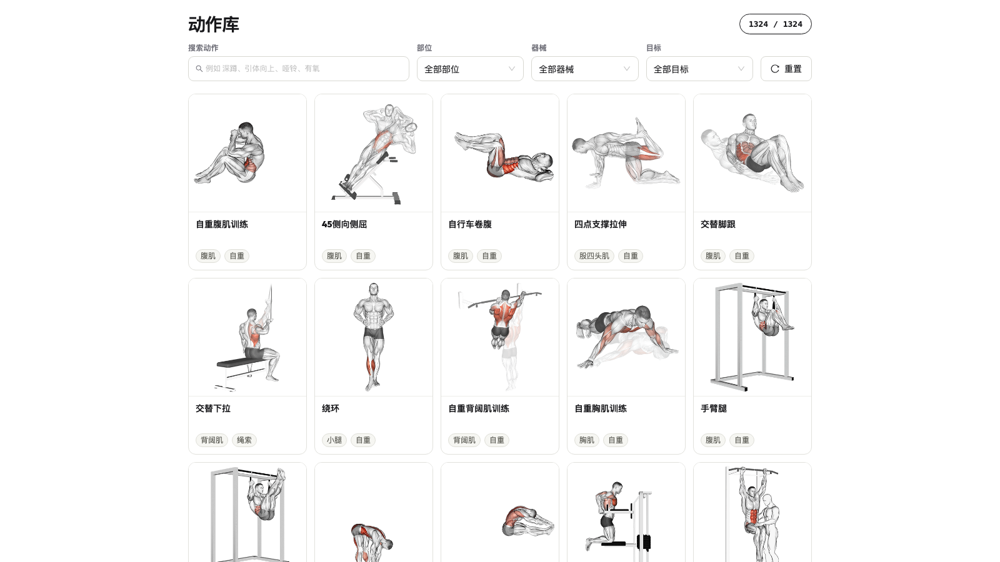
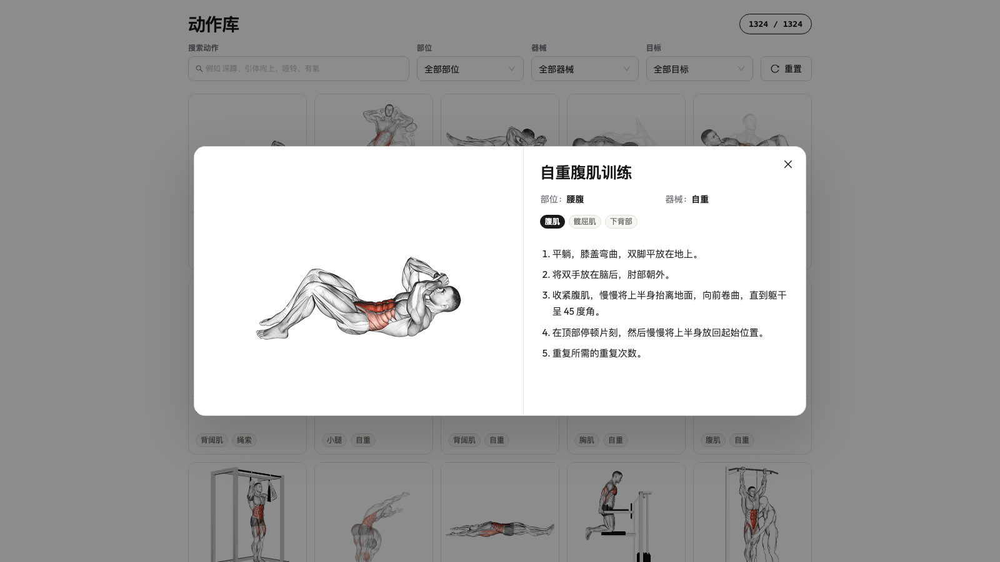

# exercise
健身库

## 页面展示

### 动作列表



### 动作详情



## Web 项目运行

进入 Web 项目目录：

```bash
cd web
```

安装依赖：

```bash
npm install
```

本地启动：

```bash
npm run dev
```

启动后访问：

```text
http://127.0.0.1:5173/
```

构建生产版本：

```bash
npm run build
```

预览构建结果：

```bash
npm run preview
```
